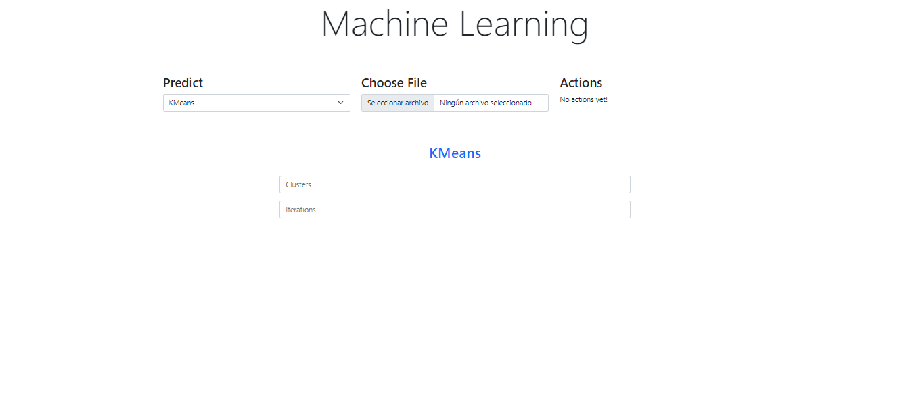
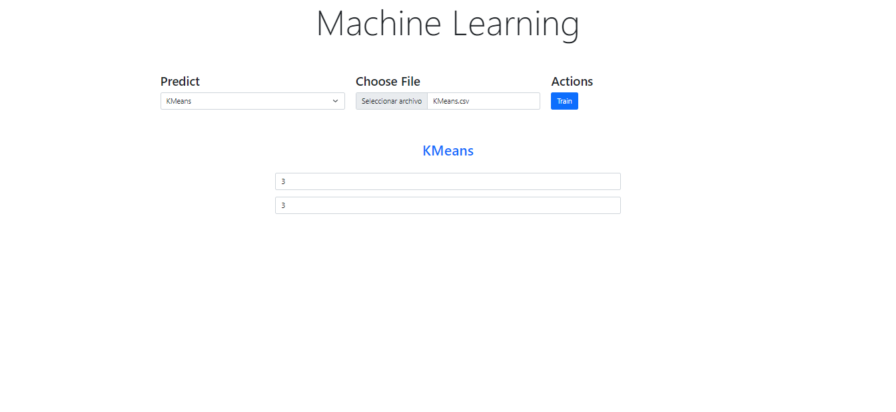
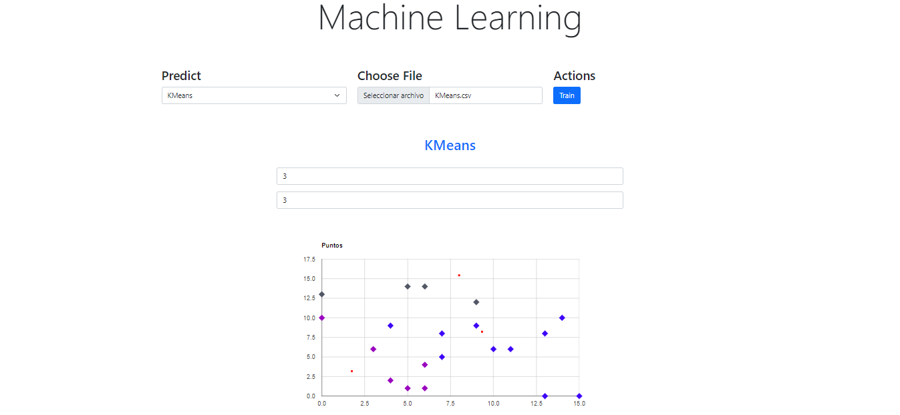
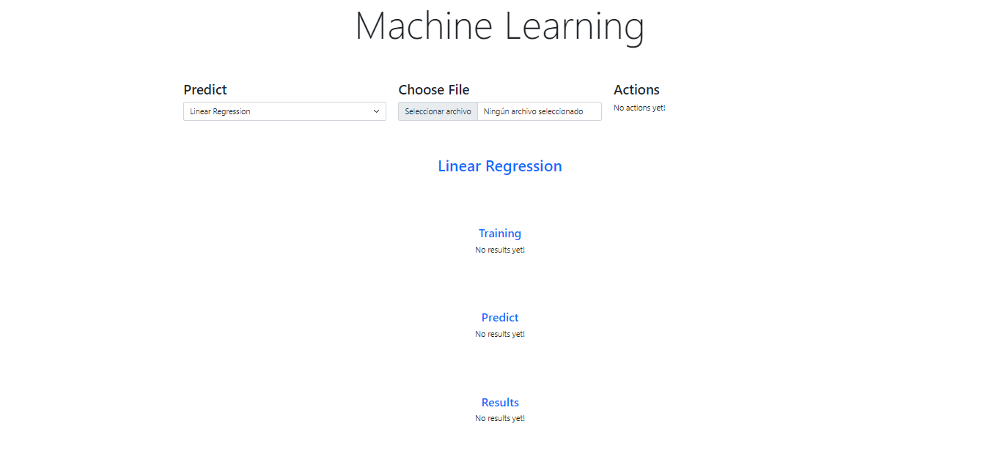
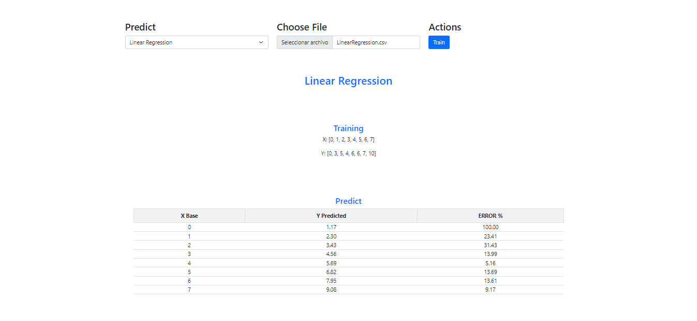
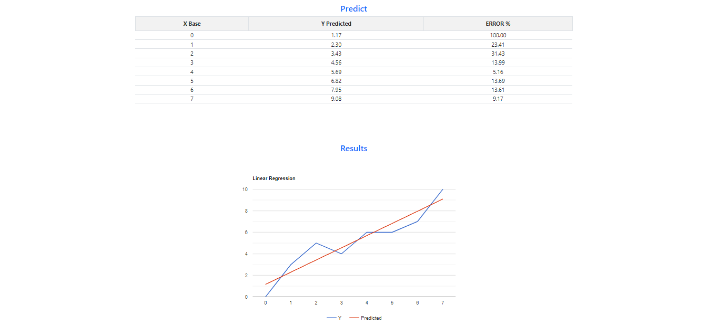
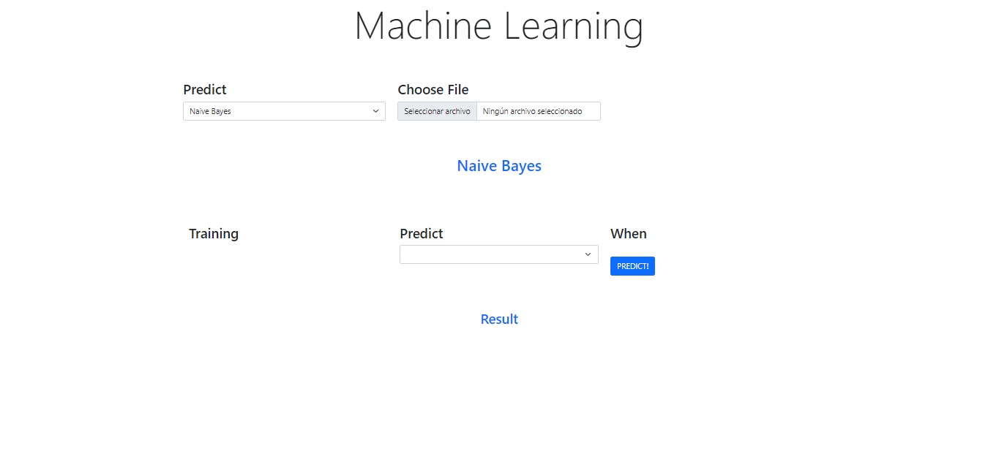
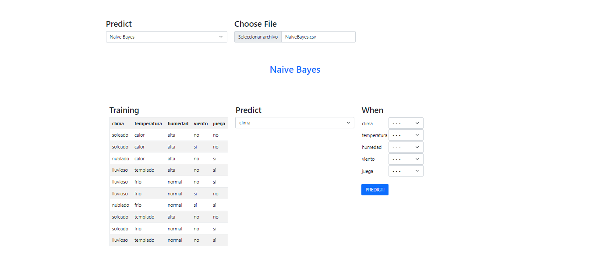
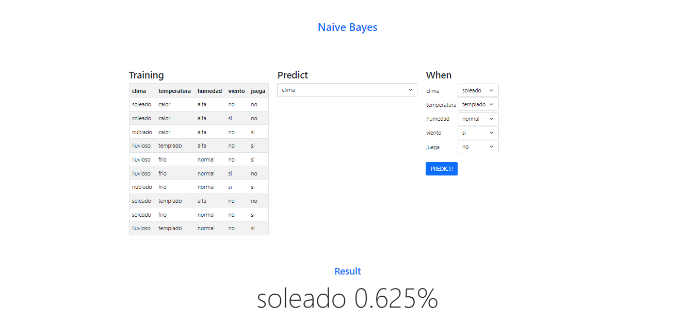

*Universidad de San Carlos de Guatemala*  
*Facultad de Ingenieria*  
*Escuela de Ciencias y Sistemas*  
*Inteligencia Artificial 1*  
*Segundo Semestre 2024.*  

**Proyecto 2**  
**Machine Learning**  
___
**201908355 - Danny Hugo Bryan Tejaxún Pichiyá**  

# Manual De Usuario

# Modelos
Para todos los modelos es necesario cargar un archivo en formato csv con los datos necesarios para el entrenamiento, predicción y, según sea el caso, mostrar una gráfica o tabla de resultados.

## KMeans 2D


Para este modelo se habilitan 2 input text para ingresar la `cantidad de clusters` y el `número de iteraciones` para evaluar.

Para el entrenamiento y predicción, el botón en la sección de `Actions` cambiará dependiendo de la acción que se ha realizado con anterioridad. Puede ser para Entrenamiento (`Train`), Predicción (`Predict`) o Mostrar Gráfico de resultados (`Graphic`).



Los resultados se muestran en un agráfica de puntos.



## Linear Regression


Para el entrenamiento y predicción, el botón en la sección de `Actions` cambiará dependiendo de la acción que se ha realizado con anterioridad. Puede ser para Entrenamiento (`Train`), Predicción (`Predict`) o Mostrar Gráfico de resultados (`Graphic`).



Los resultados se mostrarán en las respectivas secciones, que corresponden a cada acción que realiza el botón en la sección de `Actions` (`Train`, `Predict`, `Graphic`).



## Naive Bayes


* Se habilita una sección donde se muestra la tabla para el Entrenamiento (`Train`) con los datos que se leen del archivo de entrada correspondiente.
* En la sección de Predicción (`Predict`) se habilita un Combo Box (`Select`) donde se se lecciona el parámetro de la predicción.
* En la sección de Condicionamiento (`When`) se establecen los parámetros que condicionan un estado o combinación de valores.



Al dar click en el botón de predicción (`Predict`) se muestra en la sección de resultados (`Result`) el porcentaje de probabilidad del valor del parámetro con mayor probabilidad que podría ocurrir.



# Manual Técnico

# Modelos

## KMeans 2D
El código define una clase llamada `KMeansModel`, diseñada para implementar un modelo de agrupamiento utilizando el algoritmo `K-Means` en dos dimensiones (`2D`). La clase permite cargar datos, entrenar el modelo, predecir agrupamientos, graficar los resultados y resetear el estado del modelo.

```js
const KMeansModel = class {
    constructor() {
        this.isTrained = false
        this.isPredict = false
        this.xValues = []
        this.yValues = []
        this.data = []
        this.clusters = []
        this.clusterized_data = []
    }
    ...
}
```

### Propiedades
* `isTrained`: Booleano que indica si el modelo ha sido entrenado (inicialmente `false`).
* `isPredict`: Booleano que indica si se ha realizado una predicción (inicialmente `false`).
* `xValues`: Arreglo que almacena los valores en el `eje X` de los datos (vacío al inicio).
* `yValues`: Arreglo que almacena los valores en el `eje Y` de los datos (vacío al inicio).
* `data`: Arreglo de pares `[X, Y]` que representan los datos que se agruparán.
* `clusters`: Arreglo que contiene los centroides de cada grupo después de la predicción.
* `clusterized_data`: Arreglo que contiene los datos ya agrupados junto con la información de a qué grupo pertenece cada punto.

### Métodos
1. `train(data)`  
Este método recibe un conjunto de datos, los procesa y entrena el modelo `K-Means` con estos datos.  
* **Entrada**: `data` es un arreglo de objetos, donde cada objeto tiene propiedades EjeX y EjeY.
* **Pasos**:  
    * Convierte cada elemento de `data` en un par de números `[EjeX, EjeY]` y los almacena en `this.data`.
    * Obtiene el valor de `k` (`número de clusters`) de un elemento `HTML` con el id `cluster_count`.
    * Inicializa una instancia de `_2DKMeans` con k y `this.data`.
    * Cambia `isTrained` a `true` para indicar que el modelo ha sido entrenado.
* **Manejo de Errores**: Si ocurre un error, lo muestra en la consola y despliega una alerta.

```js
train = (data) => {
    try {
        console.log('Training KMeans')
        this.data = data.map(item => [Number(item.EjeX), Number(item.EjeY)]);
        console.log(this.data)
        let k = document.getElementById('cluster_count').value
        this.kmeans = new _2DKMeans(k, this.data)
        this.isTrained = true
    } catch (error) {
        console.log(error)
        alert('Error training KMeans')
    }
}
```

2. `predict()`  
Este método realiza la predicción de los clusters usando los datos y el número de clusters definido en el train.

* **Pasos**:
    * Obtiene `k` (`número de clusters`) y `iterations` (`número de iteraciones`) desde el `HTML`.
    * Llama al método clusterize de `_2DKMeans`, que devuelve los datos agrupados.
    * Extrae los `centroides` de los `clusters` y los filtra para asegurar que no haya `duplicados`.
    * Asigna un color aleatorio a cada `centroide` para diferenciar visualmente cada `cluster`.
    * Cambia `isPredict` a `true` para indicar que la predicción se ha realizado.
* **Manejo de Errores**: Si ocurre un error, lo muestra en la consola y despliega una alerta.

```js
predict = () => {
    try {
        console.log('Predict KMeans')
        let k = document.getElementById('cluster_count').value
        let iterations = document.getElementById('iterations').value
        this.clusterized_data = this.kmeans.clusterize(k, this.data, iterations)
        this.clusters = this.clusterized_data.map(a => [a[1][0], a[1][1]])
        this.clusters = this.clusters.filter((v, i, a) => a.findIndex(t => (JSON.stringify(t) === JSON.stringify(v))) === i)
        this.clusters.forEach((cluster, i) => {
            this.clusters[i] = [cluster, "#000000".replace(/0/g, function () { return (~~(Math.random() * 16)).toString(16); })]
        });

        console.log(this.clusters)
        this.isPredict = true
    } catch (error) {
        console.log(error)
        alert('Error predict KMeans')
    }
}
```

3. `graphic()`  
Este método grafica los resultados de la predicción utilizando la biblioteca Google Charts.

* **Pasos**:
    * Carga la biblioteca de gráficos de `Google Charts`.
    * Define la función `drawChart`, que configura el gráfico:
        * Crea un `DataTable` de `Google` con columnas para los `ejes` `X`, `Y` y el estilo.
        * Agrega `puntos de datos` agrupados y sus colores correspondientes.
        * Agrega los `centroides` de cada `cluster` en color `rojo` para diferenciarlos.
    * Configura el gráfico como un `gráfico de dispersión` (`ScatterChart`) con etiquetas para los `ejes` `X` y `Y`.
    * Dibuja el gráfico en un elemento `HTML` con el id `chart_div`.
```js
graphic = () => {
    google.charts.load('current', { 'packages': ['corechart'] });

    const drawChart = () => {
        var graph_data = new google.visualization.DataTable();
        graph_data.addColumn('number', 'X')
        graph_data.addColumn('number', 'Y')
        graph_data.addColumn({ type: 'string', role: 'style' }); // style col.
        let a = this.clusterized_data.map(e => [e[0][0], e[0][1], `point { size: 7; shape-type: diamond; fill-color: ${this.clusters[this.clusters.findIndex(a => JSON.stringify(a[0]) == JSON.stringify(e[1]))][1]}}`])

        graph_data.addRows(a)

        this.clusters.forEach(c => {
            graph_data.addRow([c[0][0], c[0][1], `point { size: 3; shape-type: square; fill-color: #ff0000`])
        });

        var options = {
            title: 'Puntos',
            seriesType: 'scatter',
            series: { 1: { type: 'line' } },
            hAxis: { title: 'X' },
            yAxis: { title: 'Y' },
            legend: 'none'
        };

        var chart = new google.visualization.ScatterChart(document.getElementById('chart_div'));
        chart.draw(graph_data, options);
    }

    google.charts.setOnLoadCallback(function () { drawChart() });
}
```

4. `reset()`  
Este método reinicia el estado del modelo, eliminando todos los datos cargados y limpiando cualquier estado de entrenamiento o predicción.

* **Pasos**:
    * Restablece `isTrained` e `isPredict` a `false`.
    * Limpia `xValues`, `yValues`, `data`, y `clusters`.

```js
reset = () => {
    this.isTrained = false
    this.isPredict = false
    this.xValues = []
    this.yValues = []
    this.data = []
    this.clusters = []
}
```

## Linear Regression
La clase `LinearRegressionModel` implementa un modelo de regresión lineal para entrenar, predecir y graficar los datos utilizando Google Charts. También incluye métodos para gestionar el estado del modelo y reiniciar sus parámetros.

```js
const LinearRegressionModel = class {
    constructor() {
        this.isTrained = false
        this.isPredict = false
        this.linearRegresion = new LinearRegression();
        this.xValues = []
        this.yValues = []
        this.result = null
    }
    ...
}
```

### Propiedades
* `isTrained`: Booleano que indica si el modelo ha sido entrenado (inicialmente `false`).
* `isPredict`: Booleano que indica si se ha realizado una predicción (inicialmente `false`).
* `linearRegresion`: Instancia de la clase `LinearRegression` para realizar el ajuste del modelo de regresión lineal.
* `xValues`: Arreglo que almacena los valores en el `eje X` de los datos de entrada.
* `yValues`: Arreglo que almacena los valores en el `eje Y` de los datos de entrada.
* `result`: Arreglo que contiene los valores predichos para el `eje Y` después de la predicción.

### Métodos
1. `train(data)`  
Este método entrena el modelo de regresión lineal utilizando los datos de entrada.  
* **Entrada**: `data`, un arreglo de objetos con propiedades `EjeX` y `EjeY`.
* **Pasos**:
    * Convierte los valores de `EjeX` y `EjeY` a números decimales y los almacena en los arreglos `xValues` y `yValues`.
    * Muestra los valores de `X` e `Y` en un elemento `HTML` con el id `data_training`.
    * Llama al método `fit` de la instancia `linearRegresion` para ajustar el modelo a los datos de entrada.
    * Cambia `isTrained` a `true` para indicar que el modelo ha sido entrenado.
* **Manejo de Errores**: Si ocurre un error, lo muestra en la consola y despliega una alerta.

```js
train = (data) => {
    try {
        console.log('Training LinearRegression')
        this.xValues = data.map(item => parseFloat(item.EjeX));
        this.yValues = data.map(item => parseFloat(item.EjeY));
        document.getElementById('data_training').innerHTML = `<p>X: [${this.xValues.join(', ')}]</p><p>Y: [${this.yValues.join(', ')}]</p>`
		this.linearRegresion.fit(this.xValues, this.yValues);
        this.isTrained = true
    } catch (error) {
        console.log(error)
        alert('Error training LinearRegression')
    }
}
```

2. `predict()`  
Este método utiliza el modelo entrenado para predecir valores en el eje Y a partir de los valores en el eje X.

* **Pasos**:
    * Llama al método `predict` de `linearRegresion` para calcular las predicciones basadas en `xValues`.
    * Muestra los resultados en una tabla `HTML` con el id `displayTable`, que contiene:
        * `X Base`: valores originales de `X`.
        * `Y Predicted`: valores predichos por el modelo.
        * `ERROR %`: el porcentaje de error entre los valores predichos y los valores reales.
    * Cambia `isPredict` a `true` para indicar que la predicción se ha realizado.
* **Manejo de Errores**: Si ocurre un error, lo muestra en la consola y despliega una alerta.

```js
predict = () => {
    try {
        console.log('Predict LinearRegression')
        this.result = this.linearRegresion.predict(this.xValues);
        document.getElementById('predict_result').innerHTML = `<center><table id="displayTable" class="table table-striped table-bordered table-hover text-center"><tr><th>X Base</th><th>Y Predicted</th><th>ERROR %</th></tr></table></center>`
		let displayTable = document.getElementById("displayTable");
		for (let i = 0; i < this.xValues.length; i++) {
			const x = this.xValues[i];
			const y = this.result[i];
			let row = document.createElement("tr");
			let xCol = document.createElement("td");
			xCol.innerText = x.toString();
			let yCol = document.createElement("td");
			yCol.innerText = y.toFixed(2).toString();
			let errCol = document.createElement("td");
			errCol.innerHTML =
				((Math.abs(parseFloat(this.yValues[i]) - parseFloat(this.result[i])) /
					parseFloat(this.yValues[i]) ===
				Infinity
					? 1.0
					: Math.abs(parseFloat(this.yValues[i]) - parseFloat(this.result[i])) /
					  parseFloat(this.yValues[i])) * 100.0).toFixed(2);
			row.appendChild(xCol);
			row.appendChild(yCol);
			row.appendChild(errCol);
			displayTable.appendChild(row);
		}
        this.isPredict = true
    } catch (error) {
        console.log(error)
        alert('Error predict LinearRegression')
    }
}
```

3. `graphic()`  
Este método grafica los resultados de la predicción y los valores reales en una gráfica de línea usando Google Charts.

* **Pasos**:
    * Inicializa un contenedor HTML para el gráfico con el id curve_chart.
    * Crea un conjunto de datos graphDataSet que contiene los valores originales y los valores predichos.
    * Carga la biblioteca corechart de Google Charts.
    * Define la función drawChart, que:
        * Convierte graphDataSet a un formato adecuado para Google Charts.
        * Configura el gráfico de línea con un título y sin leyenda.
        * Dibuja el gráfico en el contenedor curve_chart.
    * Llama a drawChart para renderizar el gráfico una vez que la biblioteca de Google Charts esté lista.

```js
graphic = () => {
    document.getElementById('results').innerHTML = '<center><div id="curve_chart" style="width: 900px; height: 500px"></div></center>'
    var graphDataSet = [];
	graphDataSet.push(["X", "Y", "Predicted"]);
	for (let i = 0; i < this.xValues.length; i++) {
		const x = this.xValues[i];
		graphDataSet.push([x.toString(), this.yValues[i], this.result[i]]);
	}
	google.charts.load("current", { packages: ["corechart"] });
    const drawChart = () => {
		var data = google.visualization.arrayToDataTable(graphDataSet);
		var options = {
			title: "Linear Regression",
			legend: { position: "bottom" },
		};
		var chart = new google.visualization.LineChart(
			document.getElementById("curve_chart")
		);
		chart.draw(data, options);
	}
	google.charts.setOnLoadCallback(drawChart);
}
```

4. `reset()`  
Este método restablece el estado del modelo, eliminando todos los datos y limpiando cualquier estado de entrenamiento o predicción.
* **Pasos**:
    * Cambia `isTrained` y `isPredict` a `false`.
    * Reinstancia `linearRegresion` como una nueva instancia de `LinearRegression`.
    * Limpia `xValues`, `yValues`, y `result`.

```js
reset = () => {
    this.isTrained = false
    this.isPredict = false
    this.linearRegresion = new LinearRegression();
    this.xValues = []
    this.yValues = []
    this.result = null
}
```

## Naive Bayes
La clase `NaiveBayesModel` implementa un modelo de `Naive Bayes`, permitiendo entrenar, predecir y reiniciar el modelo. Usa métodos para cargar datos, construir una tabla `HTML` con las variables de entrada, y crear un menú desplegable de opciones para realizar predicciones basadas en los datos entrenados.

```js
const NaiveBayesModel = class {
    constructor() {
        this.naive = new NaiveBayes();
        this.names = []
    }
    ...
}
```

### Propiedades
* `naive`: Instancia de la clase `NaiveBayes`, encargada de realizar los cálculos de probabilidad para el modelo.
* `names`: Arreglo que contiene los nombres de las características (o causas) extraídas de los datos de entrada.

### Métodos
1. `train(data)`  
Este método entrena el modelo `Naive Bayes` utilizando los datos de entrada.
* **Entrada**: `data`, un arreglo de objetos con propiedades que representan diferentes causas y efectos.
* **Pasos**:
    * Extrae los nombres de las causas y efectos únicos de los datos y los almacena en `names`.
    * Genera un objeto `values` donde cada `clave` es el `nombre` de una causa y su `valor` es un `arreglo` de `valores` correspondientes en `data`.
    * Inserta cada `causa` y sus `valores` en el modelo `naive` llamando a `insertCause` para que el modelo procese la información.
    * Genera una tabla `HTML` con los datos de entrenamiento y la muestra en un elemento con el id `tabla`.
    * Crea un menú desplegable con las causas para el efecto a predecir, mostrada en un elemento con el id `effect_dropdown`.
    * Genera una lista de selectores desplegables para cada causa, permitiendo al usuario seleccionar diferentes valores en la interfaz para realizar predicciones.
* **Manejo de Errores**: Si ocurre un error, lo registra en la consola y muestra una alerta.

```js
train = (data) => {
    try {
        console.log('Training NaiveBayes')
        this.names = [...new Set(data.flatMap(Object.keys))];
        const values = {}
        this.names.forEach(item1 => {
            values[item1] = []
            data.forEach(item2 => {
                values[item1].push(item2[item1])
            })
        })
        this.names.forEach(item1 => {
            this.naive.insertCause(item1, values[item1]);
        })

        let table = ""
        table += "<tr>"
        this.names.forEach(item => {
            table += `<th>${item}</th>`;
        })
        table += "</tr>"
        for(let i = 0; i < data.length; i ++) {
            table += "<tr>"
            this.names.forEach(item1 => {
                table += `<td>${values[item1][i]}</td>`
            })
            table += "</tr>"
        }
        document.getElementById("tabla").innerHTML = table

        let drop = "";
        this.names.forEach(item => {
            drop += `<option value="${item}">${item}</option>`
        })
        document.getElementById("effect_dropdown").innerHTML = drop

        let event_causes = "<table>";
        let causes = this.naive.causes;
        for (let index = 0; index < causes.length; index ++) {
            event_causes += `<tr><td><label id=label_${index + 1}>${causes[index][0]}</label><td>`;
            event_causes += `<td><select class="form-select" name="cause" id="cause${index + 1}_dropdown\">`;
                var events = Array.from(new Set(causes[index][1]));
                event_causes += `<option value="">- - -</option>`
                for (let x = 0; x < events.length; x ++) {
                    event_causes += "<option value=" + events[x] + ">" + events[x] + "</option>"
                }
            event_causes += "</select></td></tr>";
        }
        document.getElementById("events").innerHTML = event_causes;
    } catch (error) {
        console.log(error)
        alert('Error training NaiveBayes')
    }
}
```

2. `predict()`  
Este método realiza una predicción usando el modelo `Naive Bayes`.

* **Pasos**:
    * Obtiene el valor seleccionado en el menú desplegable `effect_dropdown`, que representa el efecto a predecir.
    * Recolecta los valores seleccionados en los menús desplegables de las causas (`causeX_dropdown`) y los almacena en `my_causes`.
    * Llama al método `predict` de `naive`, pasando el efecto y las causas seleccionadas.
    * Muestra el resultado de la predicción en un elemento `HTML` con el id `predict_result`.

```js
predict = () => {
    console.log('Predict NaiveBayes')
    var effect = document.getElementById("effect_dropdown").value;
    let my_causes = [];

    for (let index = 0; index < this.names.length - 1; index++) {
        let id = index + 1;
        let label_text = document.getElementById("label_" + id).innerText;
        if (effect != "") {
            my_causes.push([label_text,document.getElementById("cause" + id + "_dropdown").value])
        }
    }

    var prediction = this.naive.predict(effect, my_causes);
    document.getElementById("predict_result").innerHTML = prediction[0] + " " + prediction[1];
}
```

3. `reset()`  
Este método reinicia el modelo Naive Bayes a su estado inicial.

* **Pasos**:
    * Reinstancia `naive` como una nueva instancia de `NaiveBayes` para limpiar los datos anteriores y preparar el modelo para nuevos datos.

```js
reset = () => {
    this.naive = new NaiveBayes();
    this.names = []
}
```